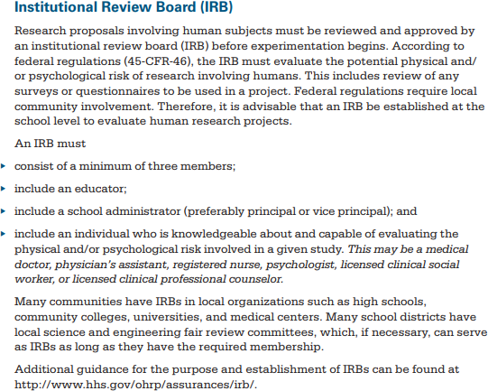

# AP_Research_IRB_Guidelines_SSBS

# SHANGHAI STARRIVER BILINGUAL SCHOOL AP RESEARCH

> CAMPUS INSTITUTIONAL REVIEW BOARD GUIDELINES
> 
> 
> This document explains the guidelines for students in the AP Research course to obtain permission to conduct research in Shanghai Starriver Bilingual School (SSBS) involving human subjects and includes an application that must be completed and submitted to the respective school’s Institutional Review Board (IRB) for approval. “**Human subject**” means a living individual about whom an investigator (whether professional or student) conducting research obtains (1) data through intervention or interaction **with** the individual, or (2) identifiable private information.
> 
> According to The College Board:
> 

> Taken from page 44 of the AP Research Course and Exam Description
> 
> 
> All requests for conducting research must follow specific guidelines, which were established for the following reasons:
> 
- To protect the rights and privacy of students, parents/guardians, and staff
- To promote continuous program improvement
- To add to the body of knowledge in the chosen research field
- To protect the integrity of Shanghai Starriver Bilingual School

# GUIDELINES FOR OBTAINING PERMISSION

## Definition

> Research is defined as any data collection from or about schools, students, parents, or staff OR any research outside the school system conducted by SSBS students (researchers). Research includes, but is not limited to, data collection for the purposes of fulfilling the requirements of classes (e.g. AP Research) or publication in a journal or book.
> 

## Purpose

> The purpose of this document is to establish a standard procedure for students to follow when requesting to conduct original research involving human subjects.
> 

## Requirements

> SSBS requires that researchers
> 
- receive permission to conduct research from the campus IRB;
- give written assurance that individuals, schools, or the district are not identifiable in the final research study or report;
- give assurance the project has no undue effect and does not interfere with campus operation

## Steps to follow when requesting permission to conduct research:

1. Complete the attached [SSBS Research Application](../Internal%20Review%20Board%20(IRB)%2025f20bc7661880fe9189d018e98dc4f1.md) and have it signed by the class instructor. The application must be typed.
2. Attach copies of any questionnaires, interview protocols, tests, or data collection instruments that will be used in the study.
3. Include a full explanation of the research question(s) and the research design.
4. Submit the completed application with supporting documents to the Campus IRB.

##