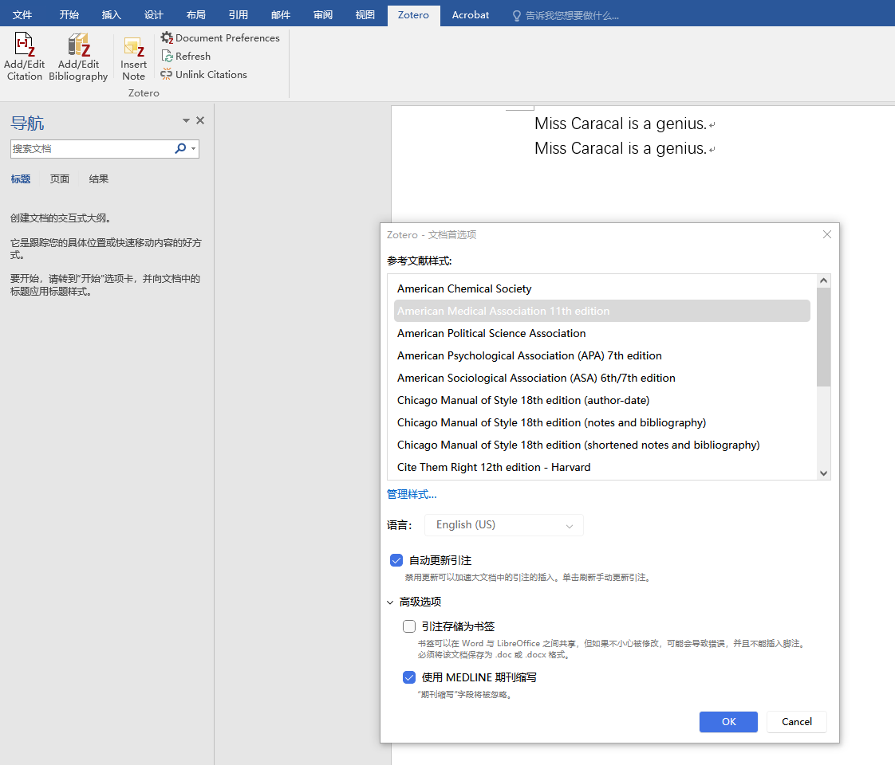
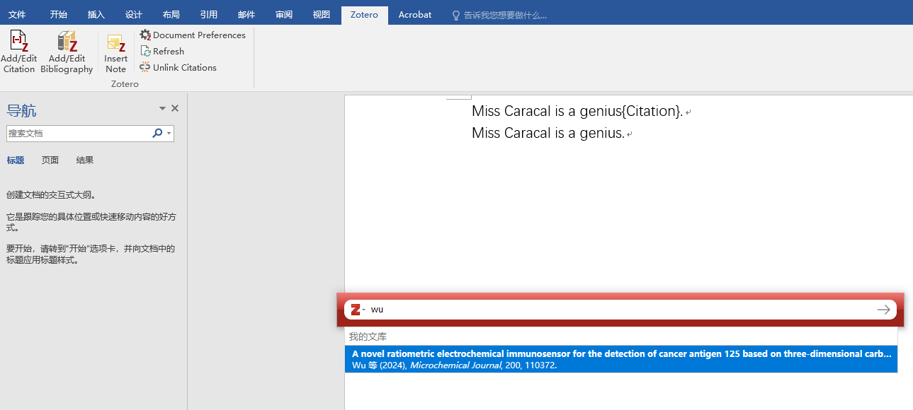
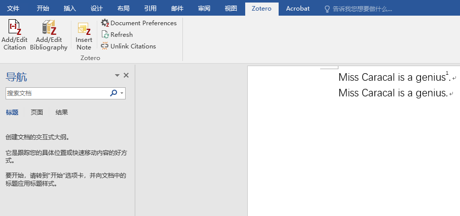
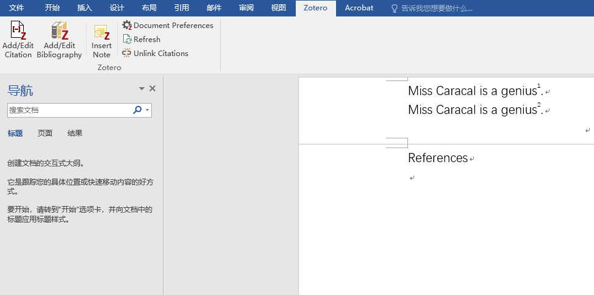
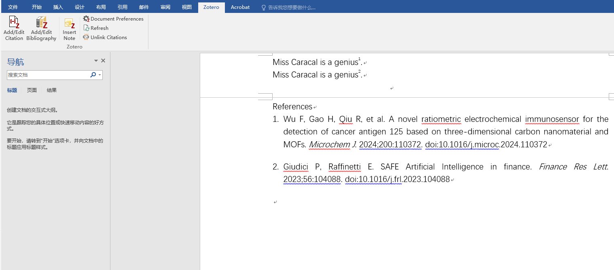

# AMA

[Source Page](https://library.south.edu/c.php?g=1025656&p=8087032)

## General Guidelines

- **Major Paper Sections**: the **Title Page**, **Abstract (If Required by Instructor)**, **Main Body**, and **Reference List**.
- **Paper size & Margin**: 8.5 x 11-inch; 1-inch margin on all sides
- **Spacing**: Double-space throughout, including the title page, block quotes, and references
- **Font & Size**: Times New Roman or Arial, 12pt
- **Indent**: the first line of each paragraph one half-inch from the left margin.
- **Header**:
    - First page only, left-hand side. Running head: TITLE OF YOUR PAPER
    - Rest of pages, left-hand side. TITLE OF YOUR PAPER
    - Right-hand side of every page. Page number. Sometimes your instructor will want your last name along with this.

## Formatting the Title Page

- Do not make a title page for your paper unless specifically requested or the paper is assigned as a group project. In the case of a group project, list all names of the contributors, giving each name its own line in the header, followed by the remaining MLA header requirements as described below. Format the remainder of the page as requested by the instructor.
- In the upper left-hand corner of the first page, list your name, your instructor's name, the course, and the date. Again, be sure to use double-spaced text.
- Double space again and center the title. Do not underline, italicize, or place your title in quotation marks. Write the title in Title Case (standard capitalization), not in all capital letters.
- Use quotation marks and/or italics when referring to other works in your title, just as you would in your text. For example: *Fear and Loathing in Las Vegas* as Morality Play; Human Weariness in "After Apple Picking"
- Double space between the title and the first line of the text.
- Create a header in the upper right-hand corner that includes your last name, followed by a space with a page number. Number all pages consecutively with Arabic numerals (1, 2, 3, 4, etc.), one-half inch from the top and flush with the right margin. (Note: Your instructor or other readers may ask that you omit the last name/page number header on your first page. Always follow instructor guidelines.)

Sample of the first page of a paper in MLA style:

## Formatting the Abstract Page (If Required by Instructor)

- Separate page after the title page.
- Abstract is the section title, it is left aligned and not indented.
- Text is in a block under the section title, it is not indented.
- Maximum 500 words.
- Does not include quotations or reference citations.
- Keywords (if required) are under the abstract with the first line indented, and the word Keywords in italics followed by a colon.
    - *Keywords:*

## Formatting the Body

- Use section and subsection headings to organize content.
    - **Introduction**
    - *Body Paragraphs*
    - *Summary*
    - **References**
- Section headings are bold and left aligned.
- Subsection headings are italicized and left aligned.
- The first line of each paragraph is indented 1/2 inch.
- There is no extra line space between paragraphs or headings.
- Block quotes are double spaced, are not indented, and are 1/2 inch from the left margin.
- Numbers: Use Arabic numerals.
    - Avoid starting a sentence with a number. If unavoidable, write out the number instead of using Arabic numerals.

## Generating in-text citations automatically with Zotero

1. Open up Zotero & your Word document of essay. Make sure that your Word is equipped with the tab of “Zotero”.

1. Click the “Document Preferences” in the Zotero tab in Word to set the citation style in Zotero to be **AMA**.

1. After the sentence of information to cite, click “Add/Edit Citation” in the Zotero tab in Word. A pop-up window of Zotero should appear. Type the keywords (title, author, etc.) into the input space in the pop-up window to find your intended article. Click the suggested article & the “→” button, and the corresponding in-text citation is generated.

Before clicking the article:

After clicking the article and the “→” button:

## Generating “References” list automatically with Zotero with one click

1. After you have finished all of your your in-text citations, on a separate “References” page (type the “References” on top of the page first, left aligned), click the “Add/Edit Bibliography” on the Zotero tab in Word, and a complete list of works cited should be generated.

Before clicking:

After clicking:

