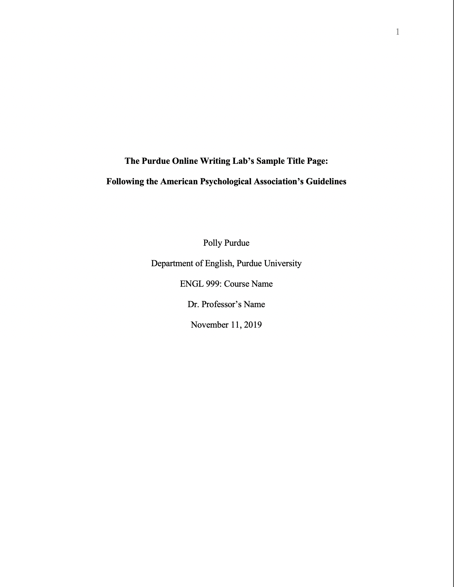
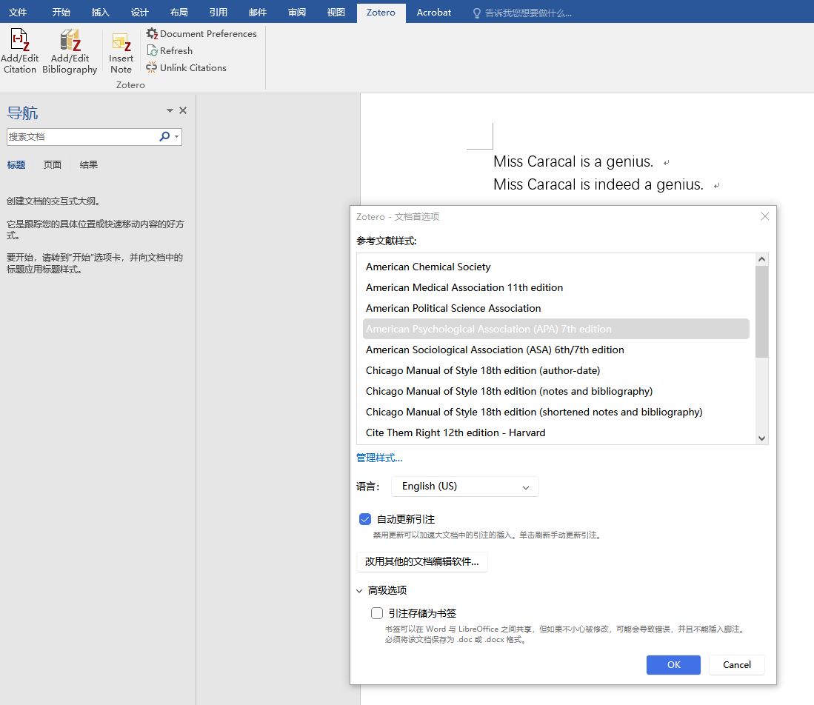
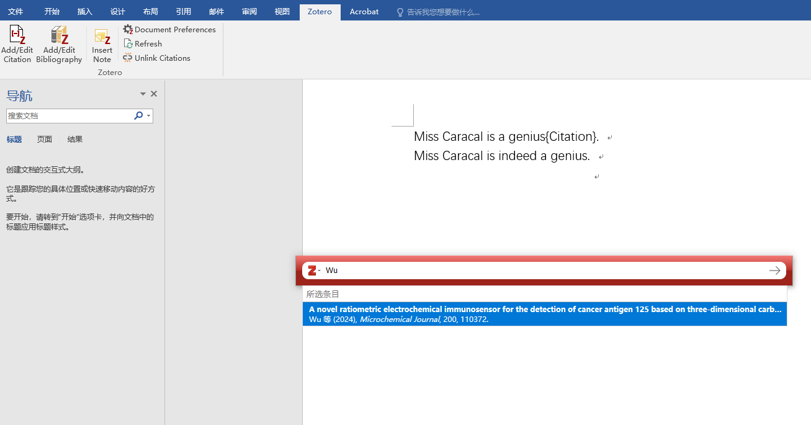
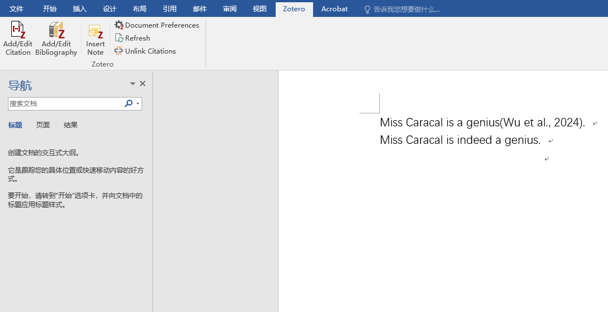
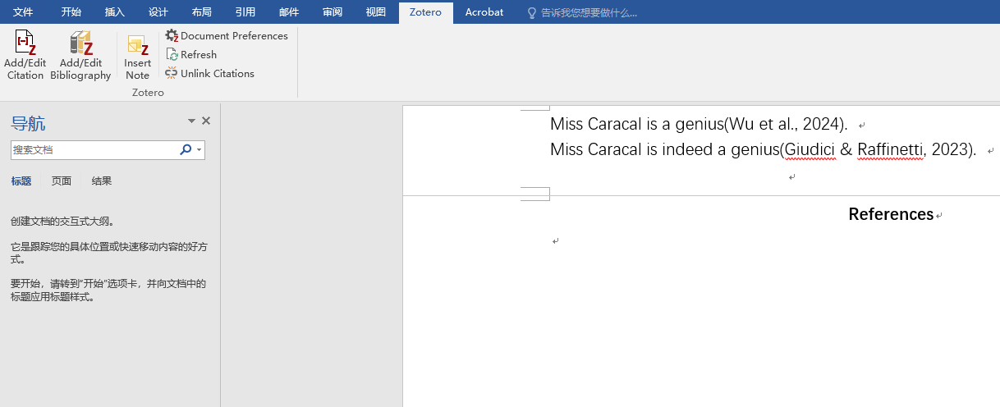
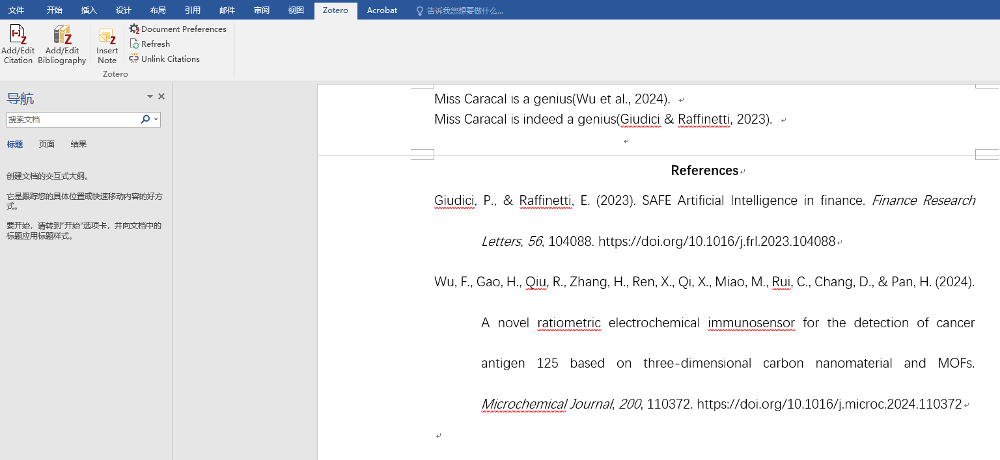

# APA

[Source Page](https://owl.purdue.edu/owl/research_and_citation/apa_style/apa_formatting_and_style_guide/general_format.html)

## General Guidelines

- **Major Paper Sections**: the **Title Page**, **Abstract**, **Main Body**, and **References**.
- **Paper size & Margin**: 8.5 x 11-inch; 1-inch margin on all sides
- **Spacing**: Double-space the text
- **Font & Size**: Recommended styles include sans serif fonts such as 11-point Calibri, 11-point Arial, and 10-point Lucida Sans Unicode as well as serif fonts such as 12-point Times New Roman, 11-point Georgia, 10-point Computer Modern
- **Indent**: the first line of each paragraph one half-inch from the left margin. MLA recommends that you use the “Tab” key as opposed to pushing the space bar five times.
- Create a **header** (the ”running head”) at the top of every page. For a professional paper, this includes your paper title and the page number. For a student paper, this only includes the page number. To create a **page header/running head**, insert page numbers flush right. Then type "TITLE OF YOUR PAPER" in the header flush left using all capital letters. The **running head** is a shortened version of your paper's title and cannot exceed 50 characters including spacing and punctuation.

## Formatting the Title Page

- The title page should contain the **title** of the paper, the **author's name**, and the **institutional affiliation**. A professional paper should also include the **author note**. A student paper should also include the **course number and name**, **instructor name**, and **assignment due date**.
- Type your **title** in upper and lowercase letters centered in the upper half of the page. The title should be centered and written in boldface. APA recommends that your title be focused and succinct and that it should not contain abbreviations or words that serve no purpose. Your title may take up one or two lines. All text on the title page, and throughout your paper, should be double-spaced.
- Beneath the title, type the **author's name**: first name, middle initial(s), and last name. Do not use titles (Dr.) or degrees (PhD).
- Beneath the author's name, type the **institutional affiliation**, which should indicate the location where the author(s) conducted the research.
- A professional paper should include the **author note** beneath the institutional affiliation, in the bottom half of the title page. This should be divided up into several paragraphs, with any paragraphs that are not relevant omitted. The first paragraph should include the author’s name, the symbol for the ORCID iD, and the URL for the ORCID iD. Any authors who do not have an ORCID iD should be omitted. The second paragraph should show any change in affiliation or any deaths of the authors. The third paragraph should include any disclosures or acknowledgements, such as study registration, open practices and data sharing, disclosure of related reports and conflicts of interest, and acknowledgement of financial support and other assistance. The fourth paragraph should include contact information for the corresponding author.
- A student paper should not include an author note.
- Note again that page headers/page numbers (described above for professional and student papers) also appear at the top of the title page. In other words, a professional paper's title page will include the title of the paper flush left in all capitals and the page number flush right, while a student paper will only contain the page number flush right.

Sample of Student APA title page

Sample of professional paper APA title page

## Formatting the Abstract Page

Begin a new page. Your abstract page should already include the **page header** (described above). On the first line of the abstract page, center and bold the word “Abstract” (no italics, underlining, or quotation marks).

Beginning with the next line, write a concise summary of the key points of your research. (Do not indent.) Your abstract should contain at least your research topic, research questions, participants, methods, results, data analysis, and conclusions. You may also include possible implications of your research and future work you see connected with your findings. Your abstract should be a single paragraph, double-spaced. Your abstract should typically be no more than 250 words.

You may also want to list keywords from your paper in your abstract. To do this, indent as you would if you were starting a new paragraph, type *Keywords:* (italicized), and then list your keywords. Listing your keywords will help researchers find your work in databases.

Abstracts are common in scholarly journal articles and are not typically required for student papers unless advised by an instructor. If you are unsure whether or not your work requires an abstract, consult your instructor for further guidance.

APA Abstract Page

## Generating in-text citations automatically with Zotero

1. Open up Zotero & your Word document of essay. Make sure that your Word is equipped with the tab of “Zotero”.

1. Click the “Document Preferences” in the Zotero tab in Word to set the citation style in Zotero to be **APA**.

1. After the sentence of information to cite, click “Add/Edit Citation” in the Zotero tab in Word. A pop-up window of Zotero should appear. Type the keywords (title, author, etc.) into the input space in the pop-up window to find your intended article. Click the suggested article & the “→” button, and the corresponding in-text citation is generated.

Before clicking the article:

After clicking the article and the “→” button:

## Generating “References” list automatically with Zotero with one click

1. After you have finished all of your your in-text citations, on a separate “Refenreces” page (Your references should begin on a new page separate from the text of the essay; label this page "References" in bold, centered at the top of the page; do NOT underline or use quotation marks for the title. All text should be double-spaced just like the rest of your essay.), click the “Add/Edit Bibliography” on the Zotero tab in Word, and a complete list of works cited should be generated.

Before clicking:

After clicking:

