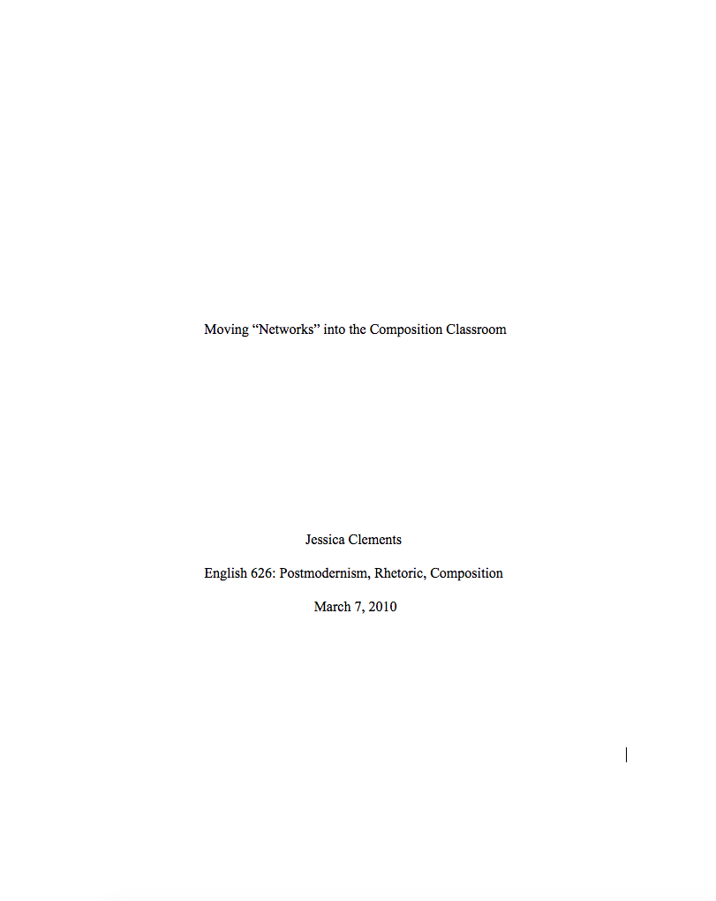
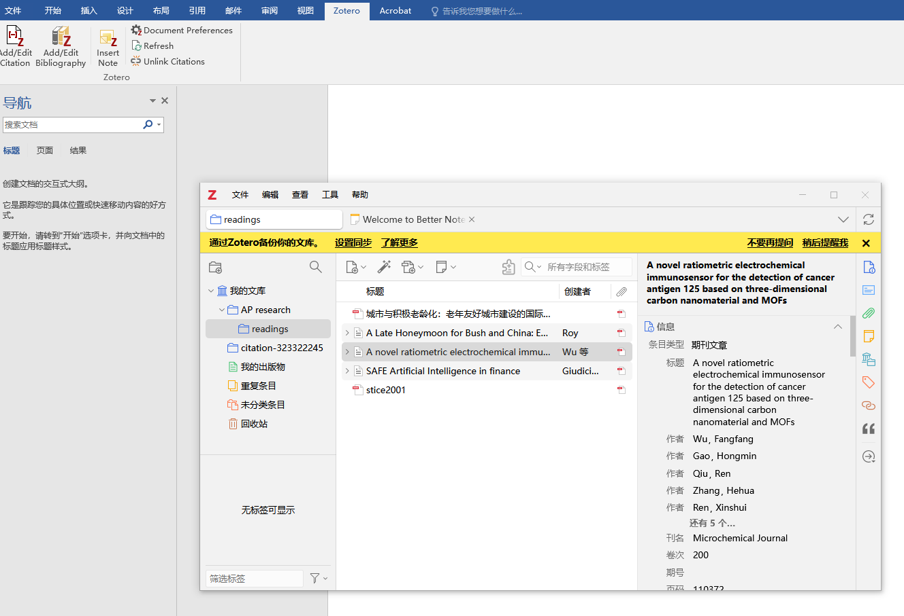
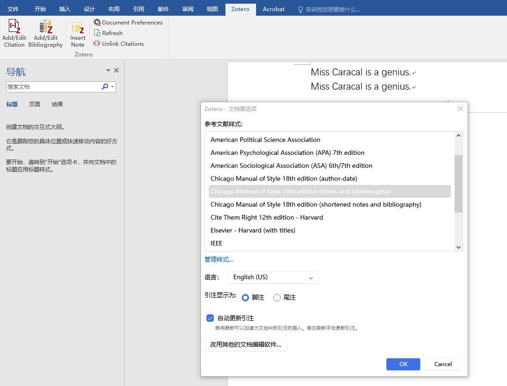
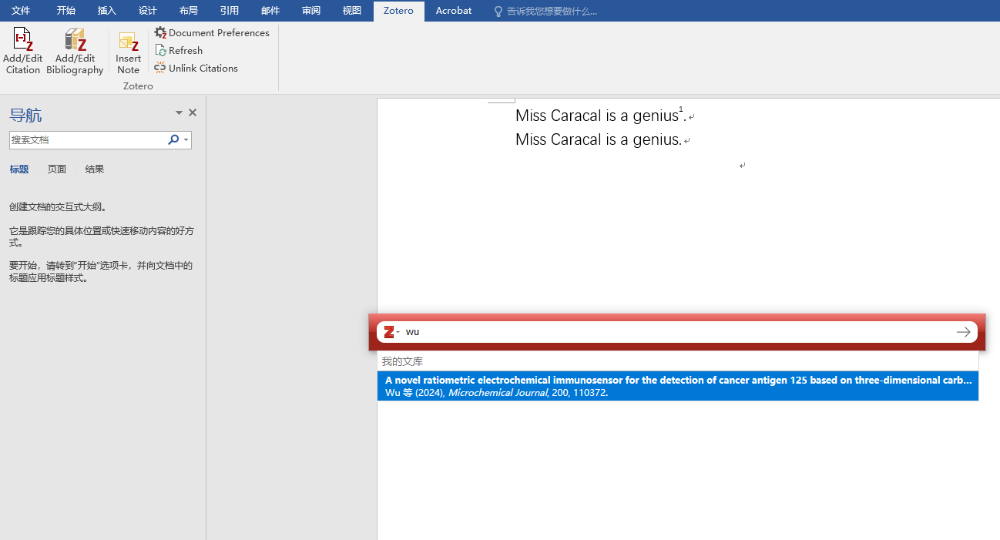
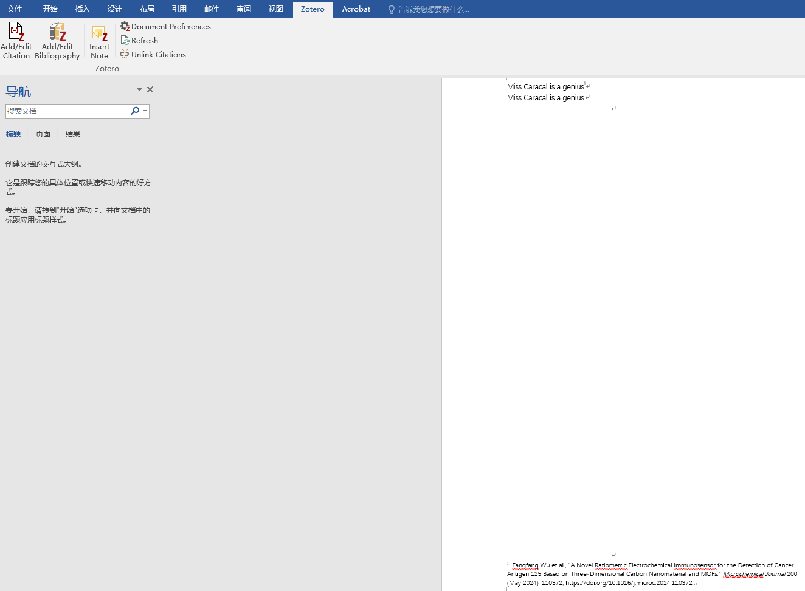
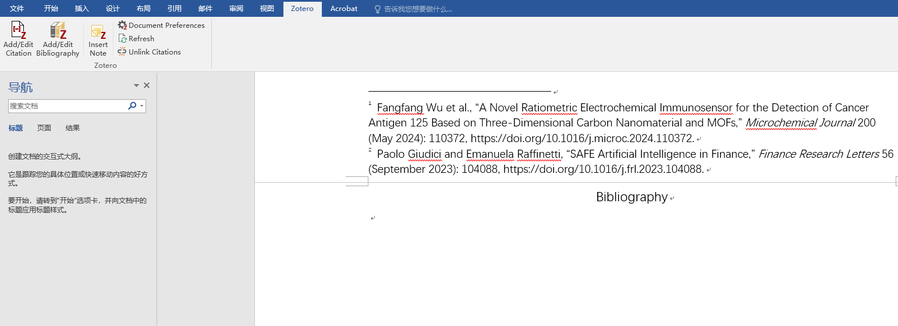
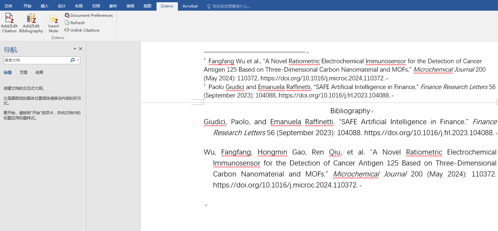

# Chicago

[Source Page](https://library.menloschool.org/chicago)

## General Guidelines

- **Major Paper Sections**: the **Cover/Title Page**, **Main Body**, **Footnote and Endnotes**, and **Reference List**.
- **Paper size & Margin**: 8.5 x 11-inch; 1-inch margin on all sides
- **Spacing**: Double-space throughout, including the title page, block quotes, and references
- **Font & Size**: Times New Roman, 12pt
- **Indent**: Use a half-inch indent for paragraph beginnings, block quotes and hanging (bibliography) indents
- Number the pages in the top right corner of the paper, beginning with the first page of text. It's a good idea to include your last name as well, in case pages become separated. Number straight through from the first text page to the final bibliography page but do not count any pages after the end of the text as part of your page count. (A five-page paper may also have a cover page, two pages of notes and one page of bibliography which is nine pieces of paper.)

## Formatting the Cover/Title Page

- Center the title of your paper in the middle of the page, halfway down.
- Center your name directly under the title.
- Your teacher's name, course title and block, and date should be written in three lines and centered at the bottom of the page.
- Use Times or Times New Roman 12 pt font for the title page.
- Do not put a page number on the cover page, and do not count it as part of the total page count.

Sample of the Cover/Title Page of a paper in Chicago style:

## Names and Numbers

- Use full names of people and agencies/legislation the first time you use them. For agencies, include the acronym in parentheses after the full name when first used, e.g. Federal Emergency Relief Administration (FERA).
- After the first time you can refer to people by their last name or agencies/bills by their acronyms for the rest of the paper.
- Write out numbers lower than 100. (“All nine members of the Supreme Court...”)

## Footnotes and Endnotes

Caution: If you are writing your paper in Google Docs, you MUST use footnotes. Google Docs does not have a way to make Endnotes, and if you use the Endnote Generator add-on it will make a mess of your paper!

- Footnotes go at the bottom of the page where the reference occurs; endnotes go on a separate page after the body of the paper. Both use the same formatting guidelines.
- Within the essay text: put the note number at the end of the sentence where the reference occurs, even if the cited material is mentioned at the beginning of the sentence.
- The note number goes after all other punctuation.
- Be sure to use Arabic numerals (1, 2, 3) nor Roman (i, ii, iii).
- Put the word Notes (not Endnotes) at the top of the page with your endnotes. Use Times/Times New Roman 10 pt font.
- Single space each entry; double space between entries.
- Indent the first line of each note.
- Never reuse a number - use a new number for each reference, even if you have used that reference previously.
- Be sure to look at shortened form examples for sources you refer to more than once.
- To cite multiple sources in a single note, separate the two citations with a semicolon. Never use two note numbers at the end of a sentence.

## Generating in-text citations automatically with Zotero

1. Open up Zotero & your Word document of essay. Make sure that your Word is equipped with the tab of “Zotero”.

1. Click the “Document Preferences” in the Zotero tab in Word to set the citation style in Zotero to be **Chicago**.

1. After the sentence of information to cite, click “Add/Edit Citation” in the Zotero tab in Word. A pop-up window of Zotero should appear. Type the keywords (title, author, etc.) into the input space in the pop-up window to find your intended article. Click the suggested article & the “→” button, and the corresponding in-text citation is generated.

Before clicking the article:

After clicking the article and the “→” button:

## Generating “Bibliography” automatically with Zotero with one click

1. After you have finished all of your your in-text citations, on a separate “Bibliography” page (the word Bibliography centered at the top of the page in Times/Times New Roman 12-pt font. Do not use bold or large size font for the heading), click the “Add/Edit Bibliography” on the Zotero tab in Word, and a complete list of works cited should be generated.

Before clicking:

After clicking:

