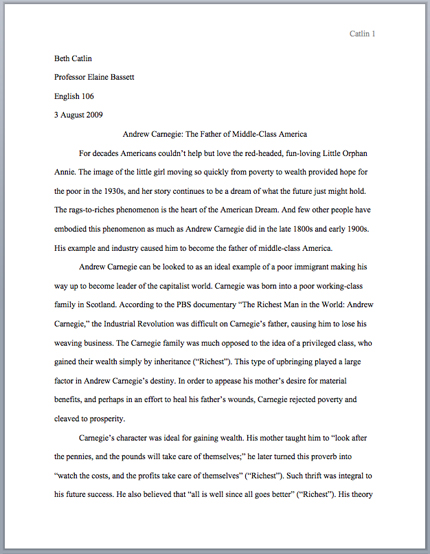
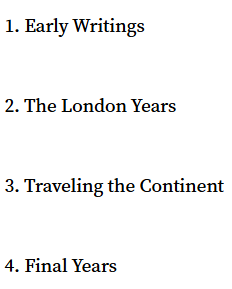
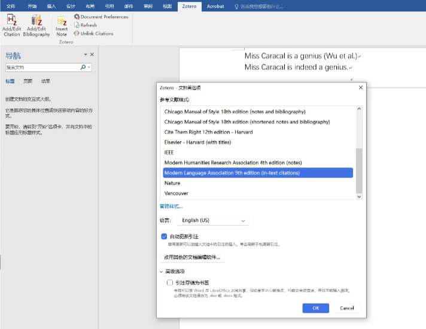
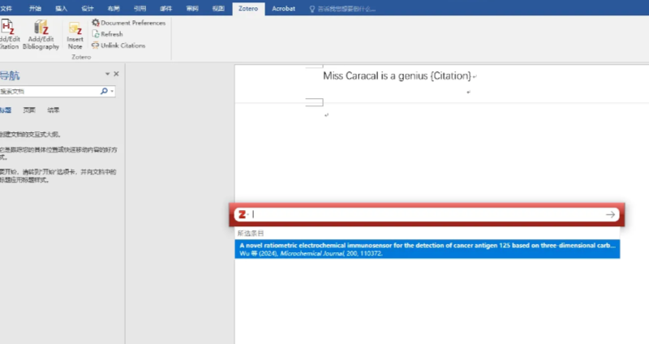
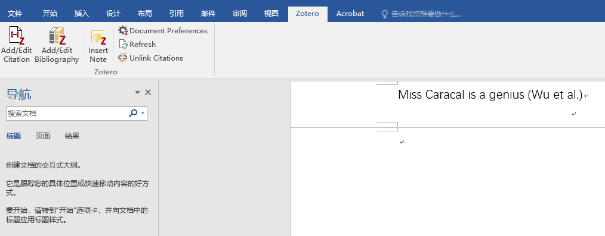
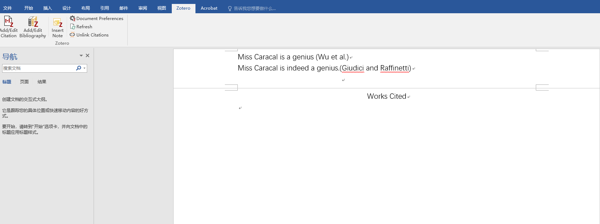
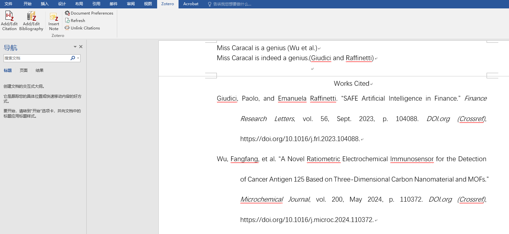

# MLA

[Source Page](https://owl.purdue.edu/owl/research_and_citation/mla_style/mla_formatting_and_style_guide/mla_general_format.html)

## General Guidelines

- **Paper size & Margin**: 8.5 x 11-inch; 1-inch margin on all sides
- **Spacing**: Double-space the text
- **Font & Size**: Times New Roman, 12pt
- **Indent**: the first line of each paragraph one half-inch from the left margin. MLA recommends that you use the “Tab” key as opposed to pushing the space bar five times.
- Create a header that numbers all pages consecutively in the upper right-hand corner, one-half inch from the top and flush with the right margin. (Note: Your instructor may ask that you omit the number on your first page. Always follow your instructor's guidelines.)
- **Use of *italics***: to indicate the titles of longer works and, only when absolutely necessary, provide emphasis

## Formatting the First Page

- Do not make a title page for your paper unless specifically requested or the paper is assigned as a group project. In the case of a group project, list all names of the contributors, giving each name its own line in the header, followed by the remaining MLA header requirements as described below. Format the remainder of the page as requested by the instructor.
- In the upper left-hand corner of the first page, list your name, your instructor's name, the course, and the date. Again, be sure to use double-spaced text.
- Double space again and center the title. Do not underline, italicize, or place your title in quotation marks. Write the title in Title Case (standard capitalization), not in all capital letters.
- Use quotation marks and/or italics when referring to other works in your title, just as you would in your text. For example: *Fear and Loathing in Las Vegas* as Morality Play; Human Weariness in "After Apple Picking"
- Double space between the title and the first line of the text.
- Create a header in the upper right-hand corner that includes your last name, followed by a space with a page number. Number all pages consecutively with Arabic numerals (1, 2, 3, 4, etc.), one-half inch from the top and flush with the right margin. (Note: Your instructor or other readers may ask that you omit the last name/page number header on your first page. Always follow instructor guidelines.)

Sample of the first page of a paper in MLA style:

## Section Headings for Essays

MLA recommends that when dividing an essay into sections you number those sections with an Arabic number and a period followed by a space and the section name.

## Generating in-text citations automatically with Zotero

1. Open up Zotero & your Word document of essay. Make sure that your Word is equipped with the tab of “Zotero”.

1. Click the “Document Preferences” in the Zotero tab in Word to set the citation style in Zotero to be **MLA**.

1. After the sentence of information to cite, click “Add/Edit Citation” in the Zotero tab in Word. A pop-up window of Zotero should appear. Type the keywords (title, author, etc.) into the input space in the pop-up window to find your intended article. Click the suggested article & the “→” button, and the corresponding in-text citation is generated.

Before clicking the article:

After clicking the article and the “→” button:

## Generating “Works Cited” list automatically with Zotero with one click

1. After you have finished all of your your in-text citations, on a separate “Works Cited” page (type the “Works Cited” on top of the page first, align to the center), click the “Add/Edit Bibliography” on the Zotero tab in Word, and a complete list of works cited should be generated.

Before clicking:

After clicking:

