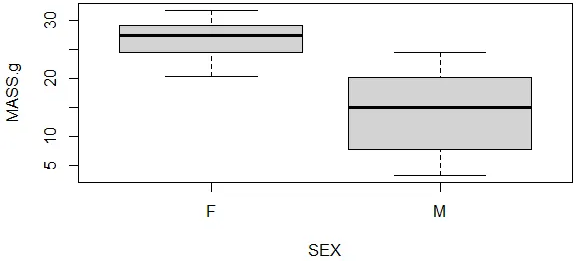

# Boxplot

Function: Provide information about whether the data is (roughly) Normally distributed
Select: Exploratory
Significance: May need to be computed first for quick data check (for Normality & variance) because a lot of statistical tests have an assumption that the data fit a Normal distribution.

# Boxplots show:

- the upper limit
- the upper quartile
- the median
- the lower quartile
- the lower limit

# What may non-Normal data look like in a boxplot?

- have a very long head or tail
- have a median very close to one of the quartiles
- have a lot of outliers shown as circles

Note that boxplots are aggressive about deeming data points to be 'outliers' and you don't usually have to remove any of these points.

# R code for boxplot (example)

- Use the following .csv file for the example coding

[skink.csv](Boxplot/skink.csv)

```r
# Import the data to R and check the structure:
skink <- read.table('skink.csv',header=T,sep=',')
str(skink)

# Do a boxplot of mass by sex:
boxplot(MASS.g~SEX,data=skink)
col=(c("grey","white")), # column shading
main="Mass (g) for females and males", # title
xlab="Sexes", ylab="Mass (g)") # variable names on x & y axes

# Do a boxplot with notch in the median. If the notches of two plots do not overlap this is 'strong evidence' that the two medians differ
boxplot(MASS.g~SEX*SITE, notch = TRUE, data=skink)

# Do a boxplot with all labels drawn perpendicular to the axes (useful if you have long labels that are difficult to read horizontally)
boxplot(MASS.g~SEX*SITE, las = 2, data=skink) # las=2 makes labels perpendicular to the axes
```

# The Graph Generated

