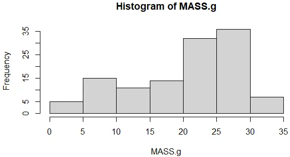

# Histogram

Function: Shows the frequency of occurrence for values in set ranges
Select: Exploratory

# R code for histogram (example)

- Use the following .csv file for the example coding

[skink.csv](Histogram/skink.csv)

```r
# Import the data to R and check the structure:
skink <- read.table('skink.csv',header=T,sep=',')
str(skink)

# Do a histogram of mass:
hist(skink$MASS.g)

# Trick: attach & detach datasets to tell R that you are using a particular dataset. Then you do not have to keep writing out the dataset name & can refere directly to columns within a dataset
attach(skink) # NOTE: Attaches the dataset
hist(MASS.g) # NOTE: creates a histogram
detach(skink) # NOTE: detaches the dataset

```

# The Graph Generated

