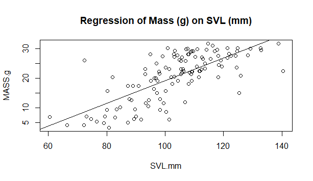

# Scatterplot

Function: Examines the relationship between two numerical values.
Select: Exploratory
Significance: Residuals between the observed value & expected value on the fitted line can be computed. See the R code on the page.

# R code for scatterplot (example)

- Use the following .csv file for the example coding

[skink.csv](Scatterplot/skink.csv)

```r
# Import the data to R and check the structure:
skink <- read.table('skink.csv',header=T,sep=',')
str(skink)

# In R, the scatterplot is a default plot, and its command is simply 'plot'
attach(skink) # so you do not need to type 'skink$column' each time
plot(MASS.g~SVL.mm) # do the scatterplot
abline(lm(MASS.g~SVL.mm)) # add a best-fit line. lm = linear model
title("Regression of Mass (g) on SVL (mm)") # add a title
detach(skink) # detach the current dataset to allow moveon to the next

# Summarize the linear model
summary(lm(MASS.g~SVL.mm, data = skink)) 
```

# The Graph Generated



# Optional: R code for finding residuals in regression model

```r
# Import the data to R and check the structure:
skink <- read.table('skink.csv',header=T,sep=',')
str(skink)

# In R, the scatterplot is a default plot, and its command is simply 'plot'
attach(skink) # so you do not need to type 'skink$column' each time
plot(MASS.g~SVL.mm, 
     pch = 16,
     cex = 1.3,
     col = "black",
     main = "RESIDUALS OF SKINK MASS AND SVL",
     xlab = "SVL (mm)",
     ylab = "MASS(g)") # do the scatterplot

#Add a line of best fit using the linear model(lm) function
model <- lm(MASS.g~SVL.mm)
abline(model)

# Generate a set of points equal to the number of observations
npoints <- length(SVL.mm) 

# Create a regression model using the predict function
fit.reg <- predict(model) 

# Add in the regression lines
for (k in 1: npoints) lines(c(SVL.mm[k], SVL.mm[k]), c(MASS.g[k], fit.reg[k]))

## Check data Normality
# Step 1: Plot a histogram of the residuals
hist(resid(model), breaks=seq(-40,40,5))

# Step 2: Use Shapiro-Wilk's test to test whether the distribution is Normal
shapiro.test(resid(model))
# P > 0.05: evidence that the distribution of residuals is probably Normal
# P < 0.05: evidence that the distribution of residuals is probably not Normal.

detach(skink) # detach the current dataset to allow moveon to the next

```


- The Shapiro-Wilk’s test’s output should look like the following:

```r
Shapiro-Wilk normality test

data:  resid(model)
W = 0.99101, p-value = 0.6274
```

- With p > 0.05, the distribution of residuals is **Normal**.