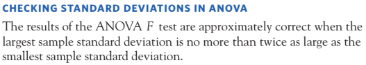

# ANOVA

Covariate: No
Levels: >2
Predictor: Discrete
Response: Continuous, Single

- The statistical test to compare ≥3 population means

# Conditions for ANOVA

- We have k independent SRSs, one from each of k populations.
- Each of the k populations has a Normal distribution with an unknown mean. The parameter *µi* is the unknown mean of the *i* th population. The means may be different in the different populations.
- All the populations have the same standard deviation σ, whose value is unknown.

# Two key questions to consider when deciding which ANOVA to use

1. The number of predictors (independent variables, IVs)
2. the number of times the subjects are measured 
    1. Once: between subjects
    2. multiple times: within-subjects

[ANOVA quick guide](ANOVA/ANOVA%20quick%20guide%202c420bc76618800089b1cbe6cfc209e2.csv)